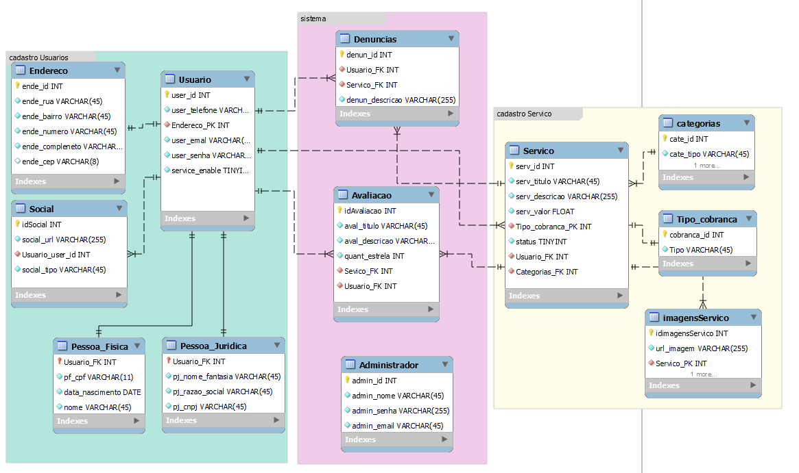

# 📄 Relatório de Modelagem de Dados  
**Plataforma de Serviços**

## 📚 Sumário
1. [Minimundo](#1-minimundo)  
2. [Documentação das Tabelas](#2-documentação-das-tabelas)  
 2.1 [Grupo 1: Cadastro de Usuários](#21-grupo-1-cadastro-de-usuários)  
 2.2 [Grupo 2: Cadastro de Serviços](#22-grupo-2-cadastro-de-serviços)  
 2.3 [Grupo 3: Gestão e Interação](#23-grupo-3-gestão-e-interação)  
3. [Resumo das Relações](#3-resumo-das-relações)  
4. [Diagramas ERD](#4-diagramas-erd)

---

## 1. 🌐 Minimundo

O sistema é uma plataforma de marketplace de serviços projetada para conectar Clientes a Prestadores de serviço de forma segura. Ele gerencia dois tipos de usuários (clientes e prestadores), armazenando seus perfis e dados pessoais. Prestadores podem cadastrar serviços com título, descrição, valor e imagens. Os serviços são organizados por categorias e tipos de cobrança. A confiança é construída por meio de avaliações dos clientes, e a segurança é garantida por um painel de administradores que aprovam manualmente novos prestadores e serviços.

---

## 2. 📁 Documentação das Tabelas

### 2.1 👤 Grupo 1: Cadastro de Usuários

#### Tabela: `Usuario`
- `user_id` (PK)
- `user_telefone` (VARCHAR(45))
- `Endereco_PK` (FK → Endereco.ende_id)
- `user_email` (VARCHAR(45))
- `user_senha` (VARCHAR(45))
- `service_enable` (TINYINT)

#### Tabela: `Endereco`
- `ende_id` (PK)
- `ende_rua` (VARCHAR(45))
- `ende_bairro` (VARCHAR(45))
- `ende_numero` (VARCHAR(45))
- `ende_complemento` (VARCHAR(45))
- `ende_cep` (VARCHAR(8))

#### Tabela: `Social`
- `idSocial` (PK)
- `social_url` (VARCHAR(255))
- `Usuario_user_id` (FK → Usuario.user_id)
- `social_tipo` (VARCHAR(45))

#### Tabela: `Pessoa_Fisica`
- `Usuario_FK` (FK → Usuario.user_id)
- `pf_cpf` (VARCHAR(11))
- `data_nascimento` (DATE)
- `nome` (VARCHAR(45))

#### Tabela: `Pessoa_Juridica`
- `Usuario_FK` (FK → Usuario.user_id)
- `pj_nome_fantasia` (VARCHAR(45))
- `pj_razao_social` (VARCHAR(45))
- `pj_cnpj` (VARCHAR(45))

---

### 2.2 🛠️ Grupo 2: Cadastro de Serviços

#### Tabela: `Servico`
- `serv_id` (PK)
- `serv_titulo` (VARCHAR(45))
- `serv_descricao` (VARCHAR(255))
- `serv_valor` (FLOAT)
- `Tipo_cobranca_PK` (FK → Tipo_cobranca.cobranca_id)
- `status` (TINYINT)
- `Usuario_FK` (FK → Usuario.user_id)
- `Categorias_FK` (FK → categorias.cate_id)

#### Tabela: `categorias`
- `cate_id` (PK)
- `cate_tipo` (VARCHAR(45))

#### Tabela: `Tipo_cobranca`
- `cobranca_id` (PK)
- `Tipo` (VARCHAR(45))

#### Tabela: `imagensServico`
- `idimagensServico` (PK)
- `url_imagem` (VARCHAR(255))
- `Servico_PK` (FK → Servico.serv_id)

---

### 2.3 🛡️ Grupo 3: Gestão e Interação

#### Tabela: `Avaliacao`
- `idAvaliacao` (PK)
- `aval_titulo` (VARCHAR(45))
- `aval_descricao` (VARCHAR(255))
- `quant_estrela` (INT)
- `Servico_FK` (FK → Servico.serv_id)
- `Usuario_FK` (FK → Usuario.user_id)

#### Tabela: `Denuncias`
- `denun_id` (PK)
- `denun_descricao` (VARCHAR(255))
- `Servico_FK` (FK → Servico.serv_id)
- `Usuario_FK` (FK → Usuario.user_id)

#### Tabela: `Administrador`
- `admin_id` (PK)
- `admin_nome` (VARCHAR(45))
- `admin_senha` (VARCHAR(255))
- `admin_email` (VARCHAR(45))

---

## 3. 🔗 Resumo das Relações

### Relações 1:1
- 1 `Usuario` tem 1 `Endereco`
- 1 `Usuario` tem 1 `Social`

### Relações 1:N
- 1 `Usuario` (Prestador) pode ter N `Servico`
- 1 `Usuario` (Cliente) pode escrever N `Avaliacao` e N `Denuncias`
- 1 `Servico` pode ter N `imagensServico`, N `Avaliacao`, N `Denuncias`
- 1 `categorias` pode conter N `Servico`
- 1 `Tipo_cobranca` pode ser usado por N `Servico`

### Tabelas de Gestão
- `Administrador` não possui relações físicas com outras tabelas, mas controla os campos `service_enable` e `status` nas tabelas `Usuario` e `Servico`.

---

## 4. 📊 Diagramas ERD

### 👤 Grupo 1: Cadastro de Usuários
 

---

### 🛠️ Grupo 2: Cadastro de Serviços
 

---

### 🛡️ Grupo 3: Gestão e Interação

---

### 🔗 Visão Geral do Modelo

