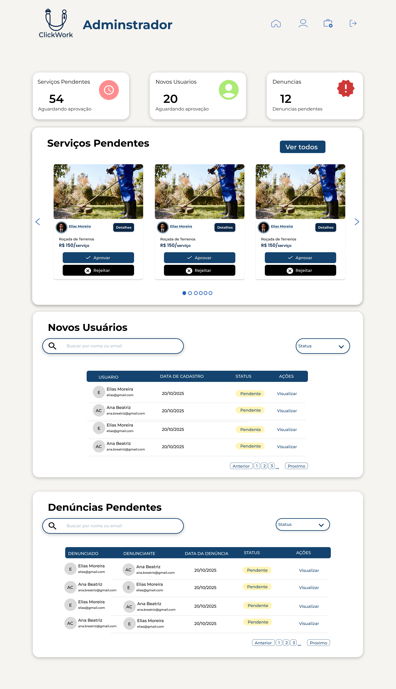

# PROJETO DE SOFTWARE

## *Stakeholders*
|NOME|CARGO|E-MAIL|
|:---|:---|:---|
|Erick Leonardo Weil|Cordenador do curso|erick.weil@ifro.edu.br|

# Sumário

* [RESUMO DO PROJETO](#resumo-do-projeto)
* [INTRODUÇÃO](#introdução)
  * [PROPÓSITO DESTE DOCUMENTO](#propósito-deste-documento)
  * [CONCEPÇÃO DO SISTEMA](#concepção-do-sistema)
* [DESCRIÇÃO GERAL](#descrição-geral)
  * [USUÁRIOS DO SISTEMA](#usuários-do-sistema)
  * [ABRANGÊNCIA E SISTEMAS SIMILARES](#abrangência-e-sistemas-similares)
  * [SUPOSIÇÕES E DEPENDÊNCIAS](#suposições-e-dependências)
* [ESTUDO DE VIABILIDADE](#estudo-de-viabilidade)
* [METODOLOGIA ADOTADA NO DESENVOLVIMENTO](#metodologia-adotada-no-desenvolvimento)
* [REQUISITOS DO SOFTWARE](#requisitos-do-software)
  * [REQUISITOS FUNCIONAIS](#requisitos-funcionais)
  * [REQUISITOS NÃO FUNCIONAIS](#requisitos-não-funcionais)
* [PROTOTIPAGEM](#prototipagem)
* [DIAGRAMA DE ATIVIDADES](#diagrama-de-atividades)
* [DIAGRAMA DE SEQUÊNCIA](#diagrama-de-sequência)
* [DIAGRAMA DE CLASSES](#diagrama-de-classes)
* [DIAGRAMA DE CASOS DE USO](#diagrama-de-casos-de-uso)
  * [ESPECIFICAÇÃO DOS CASOS DE USO](#descrição--especificação-dos-casos-de-uso)
* [REFERÊNCIAS](#referências)

# RESUMO DO PROJETO

|ITEM|DETALHES|
|:---|:---|
|NOME| Clickwork  |
|Lider do Projeto| Lucas Coimbra Santi |
|PRINCIPAL OBJETIVO | Conectar prestadores de serviços a potenciais clientes de forma eficiente. |
|BENEFÍCIOS ESPERADOS | Facilitar a comunicação de um prestador de serviços com seus clientes|
|INÍCIO E TÉRMINO PREVISTOS | 12/11/2024 - 11/03/2025 |

# INTRODUÇÃO
Este projeto tem como objetivo criar um protótipo de um site que conecte um prestador de serviços com seus cliente, tendo em vista dar aos profissionais e empresas um local para mostrar seu trabalho, portfólio e qualificações para um público amplo. e construir reputação através de avaliações, notas e depoimentos de clientes anteriores.

## PROPÓSITO DESTE DOCUMENTO
Este documento tem como propósito demonstrar como o projeto como um todo foi criado, para que foi criado e como deve ser utilizado.

## CONCEPÇÃO DO SISTEMA

Métodos utilizados para a obtenção dos requisitos do sistema:
  * Entrevistas com o cliente.
  * Pesquisas de projetos similares.
  * Pesquisas de serviços prestados 

# DESCRIÇÃO GERAL

## Usuários do sistema

| USUÁRIO | DESCRIÇÃO |
|:---|:---|
| **Usuário Padrão:** | Usuário padrão de cadastro do site que procura serviços para contratar |
| **Usuário Prestador:** | Usuário que pode postar serviços para serem prestados no site |
| **Usuário Administrador:** | Usuário que controla os serviços que são postados e os usuários que estão sendo cadastrados no site |

### Sistemas similares:
* 99Freelas

## Suposições e dependências
Os usuários poderão acessar a plataforma através de qualquer dispositivel com acesso à internet . Como se trata de uma aplicação web, não há uma configuração mínima específica para visualização. No entanto é recomendado o uso de um computador devido ao layout do site

# ESTUDO DE VIABILIDADE
O sistema é viável por sua flexibilidade e por conter capacidade de adaptação do sistema para outros municípios. O Vilhena+Pública é uma forma prática de auxiliar na prestação de serviços públicos propostos pela prefeitura da cidade.

# Metodologia Adotada no Desenvolvimento
Utilizamos um modelo de desenvolvimento  Kanban, com acompanhamento do progresso do projeto por meio da análise de Throughput, Lead Time e Cycle Time. Além disso, utilizamos o Figma para criar o protótipo do site.

# Requisitos do Software
A especificação dos requisitos deste documento deve seguir as recomendações da norma IEEE Std-830-1998, levando em conta as recomentações do documento de [características dos requisitos](caracteristicas_requisitos.md).

## Requisitos Funcionais
A tabela a seguir contém a relação dos Requisitos Funcionais elicitados, com as colunas: identificador, nome, descrição e prioridade:

| IDENTIFICADOR | NOME | DESCRIÇÃO | PRIORIDADE |
:---|:---|:---|:---|
RQ-01 | Cadastro de Usuário | No cadastro de usuario deve-se informar nome completo, e-mail válido, telefone com DDD, CPF ou CNPJ e endereço. O e-mail deve ser confirmado via link enviado automaticamente. Contas sem confirmação serão excluídas após 7 dias | Essencial
RQ-02 | Login Usuário | Após o cadastro do usuário o login pode ser realizado com o email e senha de cadastro definido pelo usuário | Essencial 
RQ-03 | Recuperar Senha | O usuário poderá recuperar sua senha informando apenas o e-mail cadastrado. O sistema enviará automaticamente um e-mail contendo um link único de redefinição, válido por 30 minutos. Caso o link expire, o usuário deverá solicitar uma nova recuperação. Todas as sessões ativas devem ser encerradas após a redefinição da senha. | Essencial
RQ-04 | Editar perfil | Os cadastros podem ser alterados após o período de verificação. Tendo seu perfil verificado e aceito, poderá alterar dados como: nome, senha, foto de perfil, endereço e etc. Pode também excluir sua conta onde seus dados e anúncios vão ser desativados imediatamente e removidos do BD após 90 dias, conforme LGPD. | Essencial
RQ-05 | Cadastro Prestador de serviços | No cadastro de prestador devem ser informados o endereço completo, documento pessoal válido (CPF/CNPJ ou RG) e, obrigatoriamente, pelo menos uma de suas redes sociais. | Essencial
RQ-06 | Publicar um serviço | Cada anúncio deve conter título, descrição, categoria, preço, tipo de cobrança (diária, por hora, por m²) e pelo menos 1 imagem. Anúncios duplicados ou com conteúdo proibido serão removidos. | Essencial
RQ-07 | Editar um serviço | Os usuários podem editar as suas respectivas postagem de serviço, como título, descrição, categoria, preço imagens | Essencial
RQ-08 | Excluir serviço | Os usuários podem excluir as suas respectivas postagem de serviço, como título, descrição, categoria, preço imagens | Essencial0
RQ-09 | Visualizar Serviços | A visualização da página do anúncio do serviço está disponível sem a necessidade de login | Essencial
RQ-10 | Avaliação e Comentários  | Os usuários podem avaliar o serviço através da publicação do mesmo. Avaliações vão de 1 a 5 estrelas e podem conter comentário opcional. Comentários ofensivos serão removidos e o usuário poderá ser suspenso. | Essencial
RQ-11 | Buscar serviço | A busca deve retornar apenas anúncios ativos e aprovados. Filtros por categoria, localização (raio em km) e faixa de preço podem ser aplicados | Essencial
RQ-12 | Sistema de denúncias | Qualquer usuário pode denunciar anúncios ou perfis. Denúncias serão analisadas em até 48h. O conteúdo denunciado ficará oculto até conclusão da análise em casos graves. | Recomendável
RQ-13 | Notificações push | Notificações serão enviadas apenas para eventos relevantes (novas mensagens, solicitações). O usuário pode gerenciar preferências no perfil. | Recomendável
RQ-14 | Ver relatórios | O painel será disponibilizado aos usuários que possuem serviços cadastrados para que podem utilizá-lo como um dashboard de relatórios gerados com base em visualizações do perfil e serviço e solicitações dos clientes | Essencial

## Requisitos Não Funcionais
A tabela a seguir contém a relação com os Requisitos Não Funcionais identificados, contendo identificador, nome e descrição:

| IDENTIFICADOR | NOME | DESCRIÇÃO |
|:---|:---|:---|
RNF-01 | Desempenho | O tempo de carregamento de qualquer página não deve exceder 3 segundos.
RNF-02 | Desempenho | A função de busca deve retornar resultados em até 2 segundos, mesmo com 10.000 serviços cadastrados.
RNF-03 | Segurança | Senhas devem ser armazenadas com algoritmo de hash seguro (ex: bcrypt).
RNF-04 | Segurança | O sistema deve estar em conformidade com a LGPD.
RNF-05 | Segurança | Toda comunicação deve ser via HTTPS.
RNF-06 | Usabilidade | Um novo prestador deve conseguir publicar seu primeiro serviço em até 5 minutos após o cadastro.
RNF-07 | Usabilidade | A plataforma deve ser responsiva (desktop, tablet, smartphone).
RNF-08 | Disponibilidade | O sistema deve estar acessível 99,5% do tempo (máx. 44h de inatividade/ano).
RNF-09 | Confiabilidade | Falha na API da Receita Federal não deve impedir cadastro, que ficará “Pendente de Validação”.
RNF-10 | Escalabilidade | O sistema deve suportar até 1.000 usuários simultâneos sem perda significativa de desempenho.
RNF-11 | Manutenibilidade | O código deve seguir clean code e ter cobertura de testes automatizados ≥ 70% em funções críticas.
RNF-12 | Compatibilidade | O sistema deve ser compatível com navegadores modernos e Android/iOS recentes.

# Prototipagem

### Fluxo Básico do Cliente

### Fluxo de Conversão (Cliente -> Prestador)

### Fluxo do Moderador (ADM)

[ [INÍCIO](#projeto-de-software) ]

[ [INÍCIO](#projeto-de-software) ]

# Diagrama de Atividades

# Diagrama de Sequência

# Diagrama de Classes

# Diagrama de Casos de Uso

## Descrição / Especificação dos Casos de Uso

### UC-01 - Realizar Cadastro|

|UC-01 - Realizar Cadastro| |
|:---|:---|
|**Descrição/Objetivo:** O caso de uso inicia-se quando um novo usuário deseja se cadastrar no sistema.|
|**Atores:** Usuário, Sistema, **Administrador**|
|**Pré-condições:** Usuário não deve estar cadastrado no sistema.|
|**Pós-condições:** Usuário cadastrado com sucesso após análise do Administrador, podendo acessar o sistema.|
|**FLUXO PRINCIPAL / BÁSICO:**|
|1. Usuário acessa a página de cadastro. |
|2. O sistema solicita informações pessoais (Nome, CPF, Telefone, E-mail, Senha, Data de Nascimento, etc.).|
|3. Usuário informa os dados solicitados.|
|4. O sistema valida o formato dos dados (ex: se o e-mail é válido).|
|5. O sistema registra as informações com um status "pendente de análise" e envia para o Administrador.|
|6. O **Administrador** acessa o painel de novos cadastros e analisa as informações.|
|7. O **Administrador** aprova o cadastro.|
|8. O sistema atualiza o status do usuário para "ativo" e notifica o usuário.|
|9. Cadastro finalizado com sucesso.|
|**FLUXOS ALTERNATIVOS / EXCESSÕES:** |
|**A1: Erro na validação dos dados (pelo Administrador):** |
|1. Se os dados fornecidos estiverem incorretos ou incompletos, o **Administrador** recusa o cadastro e informa o motivo.|
|2. O sistema notifica o usuário para corrigir os dados.|
|3. O usuário corrige os dados e reenvia (retorna ao passo 3).|
|**A2: E-mail ou CPF já cadastrado:** |
|1. Durante o passo 4, se o e-mail ou CPF informado já existir no sistema, o sistema notifica o usuário imediatamente.|
|2. O usuário pode optar por recuperar a senha ou utilizar dados diferentes.|
|3. O sistema retorna ao passo 2.|

### UC-02 - Gerenciar Perfil (Endereço e Social)

|UC-02 - Gerenciar Perfil (Endereço e Social)| |
|:---|:---|
|**Descrição/Objetivo:** O usuário autenticado adiciona ou atualiza suas informações de endereço e redes sociais, que são armazenadas em tabelas separadas por normalização.|
|**Atores:** Usuário, Sistema|
|**Pré-condições:** Usuário deve estar autenticado no sistema.|
|**Pós-condições:** As informações são salvas nas tabelas `Endereco` e/ou `Social` e vinculadas ao `Usuario`.|
|**FLUXO PRINCIPAL / BÁSICO:**|
|1. Usuário acessa a área "Meu Perfil" e seleciona "Editar Endereço". |
|2. O sistema exibe os campos: rua, bairro, número, complemento.|
|3. Usuário preenche/altera os dados e salva.|
|4. O sistema associa os dados ao usuário (via `Endereco_PK (FK)`).|
|5. Usuário seleciona "Editar Redes Sociais".|
|6. O sistema exibe os campos: Instagram, Facebook, etc..|
|7. Usuário preenche/altera os dados e salva.|
|8. O sistema associa os dados ao usuário (via `Social_FK (FK)`).|
|**FLUXOS ALTERNATIVOS / EXCESSÕES:** |
|**A1: Erro na validação dos dados:** |
|1. Se os dados fornecidos forem inválidos (ex: CEP não existe - *inferido*), o sistema informa ao usuário.|
|2. Usuário corrige os dados e reenvia.|
|3. O sistema retorna ao passo 3 ou 7.|

### UC-05 - Gerenciar (Cadastrar) Serviços

|UC-05 - Gerenciar (Cadastrar) Serviços| |
|:---|:---|
|**Descrição/Objetivo:** Um Prestador (aprovado) cadastra um novo serviço, que será submetido à aprovação do Administrador.|
|**Atores:** Prestador, Sistema, **Administrador**|
|**Pré-condições:** Usuário deve ser um Prestador aprovado (`service_enable` = 1).|
|**Pós-condições:** Um novo serviço é criado e enviado para a fila de análise do Administrador.|
|**FLUXO PRINCIPAL / BÁSICO (Criar Serviço):**|
|1. Prestador acessa "Meus Serviços" e clica em "Novo Serviço". |
|2. O sistema solicita Título, Descrição, Valor, Categoria e Tipo de Cobrança.|
|3. Prestador preenche os dados.|
|4. O sistema permite ao Prestador anexar imagens (Portfólio) e definir uma imagem de capa.|
|5. Prestador clica em "Enviar para Análise".|
|6. O sistema salva o serviço com `status` 0 (pendente) e o envia para a fila de análise do **Administrador**.|
|**FLUXOS ALTERNATIVOS / EXCESSÕES:** |
|**A1: Edição de Serviço:** |
|1. Prestador seleciona um serviço existente para editar.|
|2. O sistema exibe os dados (passos 2, 3, 4) para alteração.|
|3. Ao salvar, o sistema submete a alteração para análise do **Administrador** (retorna ao passo 6).|

### UC-06 - Publicar (Aprovar) Novo Serviço

|UC-06 - Publicar (Aprovar) Novo Serviço| |
|:---|:---|
|**Descrição/Objetivo:** O **Administrador** analisa e aprova (ou recusa) um novo serviço cadastrado por um prestador, tornando-o público.|
|**Atores:** Administrador, Sistema|
|**Pré-condições:** Administrador autenticado. Deve existir um serviço com `status` = 0 (pendente) (originado do UC-05).|
|**Pós-condições:** O `status` do serviço é alterado para 1 (aprovado) e ele se torna visível na plataforma.|
|**FLUXO PRINCIPAL / BÁSICO:**|
|1. **Administrador** acessa o painel "Serviços Pendentes de Aprovação".|
|2. O sistema exibe a lista de serviços com `status` = 0.|
|3. **Administrador** seleciona um serviço para análise (revisa título, descrição, fotos, preço).|
|4. **Administrador** aprova o serviço.|
|5. O sistema atualiza o campo `status` do `Servico` para 1 (publicado).|
|6. O sistema notifica o Prestador que seu serviço foi aprovado.|
|**FLUXOS ALTERNATIVOS / EXCESSÕES:** |
|**A1: Reprovar serviço:** |
|1. O **Administrador** recusa o serviço.|
|2. O sistema solicita que o Administrador informe um motivo.|
|3. O **Administrador** escreve o motivo da recusa.|
|4. O sistema mantém o `status` = 0 (ou altera para 'reprovado') e notifica o prestador com o motivo.|

### UC-07 - Buscar Serviços|

|UC-07 - Buscar Serviços| |
|:---|:---|
|**Descrição/Objetivo:** Um Cliente busca por serviços disponíveis na plataforma, utilizando filtros para encontrar o que precisa.|
|**Atores:** Cliente, Sistema|
|**Pré-condições:** N/A (Busca pode ser pública) ou Cliente autenticado.|
|**Pós-condições:** O sistema exibe uma lista de serviços que correspondem aos critérios.|
|**FLUXO PRINCIPAL / BÁSICO:**|
|1. Cliente acessa a página de busca.|
|2. O sistema oferece filtros por `categorias` e `Tipo_cobranca`, além de busca por texto (*inferido*).|
|3. Cliente seleciona os filtros desejados (ex: Categoria "Informática") e inicia a busca.|
|4. O sistema consulta a tabela `Servico`, filtrando apenas os que possuem `status` = 1 (aprovados).|
|5. O sistema exibe a lista de serviços encontrados.|
|**FLUXOS ALTERNATIVOS / EXCESSÕES:** |
|**A1: Nenhum serviço encontrado:** |
|1. Se a busca não retornar resultados, o sistema exibe uma mensagem informando.|

### UC-08 - Avaliar Serviço

|UC-08 - Avaliar Serviço| |
|:---|:---|
|**Descrição/Objetivo:** Um Cliente registra uma avaliação (nota e comentário) sobre um serviço que contratou, ajudando a construir a confiança da plataforma.|
|**Atores:** Cliente, Sistema|
|**Pré-condições:** Cliente autenticado. Cliente deve ter contratado o serviço (Lógica de negócio *inferida*).|
|**Pós-condições:** A avaliação é salva na tabela `Avaliacao` e associada ao serviço.|
|**FLUXO PRINCIPAL / BÁSICO:**|
|1. Cliente acessa "Meus Serviços Contratados" (*inferido*) e seleciona um serviço para avaliar.|
|2. O sistema exibe um formulário de avaliação.|
|3. O sistema solicita Título da Avaliação, Descrição (comentário) e Nota em Estrelas (1-5).|
|4. Cliente preenche os dados e envia.|
|5. O sistema salva os dados, associando o `Usuario_FK` (quem avaliou) e o `Servico_FK` (o que foi avaliado).|
|6. A avaliação fica visível na página do serviço.|
|**FLUXOS ALTERNATIVOS / EXCESSÕES:** |
|**A1: Tentativa de avaliar sem contratar:** |
|1. Se o cliente tentar avaliar um serviço que não contratou, o sistema bloqueia a ação (*inferido*).|

### UC-09 - Denunciar Serviço|

|UC-09 - Denunciar Serviço| |
|:---|:---|
|**Descrição/Objetivo:** Um Cliente denuncia um serviço que considera inadequado, submetendo a denúncia para análise do Administrador.|
|**Atores:** Cliente, Sistema, **Administrador**|
|**Pré-condições:** Cliente autenticado.|
|**Pós-condições:** A denúncia é registrada e enviada para a fila de análise do Administrador.|
|**FLUXO PRINCIPAL / BÁSICO:**|
|1. Cliente está visualizando a página de um serviço e clica em "Denunciar".|
|2. O sistema exibe um formulário solicitando a Descrição da Denúncia (motivo).|
|3. Cliente preenche o motivo e envia.|
|4. O sistema salva a denúncia, associa ao Cliente e ao Serviço, e a envia para a fila de análise do **Administrador**.|
|**FLUXOS ALTERNATIVOS / EXCESSÕES:** |
|**A1: Denúncia sem descrição:** |
|1. Se o cliente não preencher a descrição, o sistema exibe um erro e não permite o envio.|
|

### UC-10 - Revisar Denúncias|

|UC-10 - Revisar Denúncias|
|:---|:---|
|**Descrição/Objetivo:** O **Administrador** analisa denúncias feitas por clientes e toma a ação necessária.|
|**Atores:** Administrador, Sistema|
|**Pré-condições:** Administrador autenticado. Deve existir uma denúncia pendente (originada do UC-09).|
|**Pós-condições:** A denúncia é marcada como "revisada" e uma ação é tomada.|
|**FLUXO PRINCIPAL / BÁSICO:**|
|1. **Administrador** acessa o painel "Denúncias".|
|2. O sistema exibe a lista de denúncias pendentes.|
|3. **Administrador** seleciona uma denúncia para análise.|
|4. **Administrador** avalia a denúncia e decide a ação (ex: suspender o serviço, notificar o prestador, etc.).|
|5. O **Administrador** registra sua decisão no sistema.|
|6. O sistema marca a denúncia como resolvida.|
|**FLUXOS ALTERNATIVOS / EXCESSÕES:** |
|**A1: Denúncia improcedente:** |
|1. O **Administrador** analisa e marca a denúncia como "improcedente".|
|2. O sistema arquiva a denúncia.|

[ [INÍCIO](#projeto-de-software) ]

# REFERÊNCIAS

Esta subseção apresenta as referências aos documentos que utilizamos no auxílio à construção deste documento.
* [UML](https://www.omg.org/spec/UML/2.5/About-UML/)
* [Práticas para Especificação de Requisitos IEEE-830](https://ieeexplore.ieee.org/document/720574)
